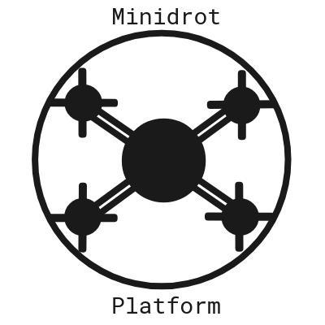

---
# 1. [Minidrot - Platform](https://github.com/awilkie/aeroautonomous/projects/1)

Small quadrotor drone robot (Minidrot) platform (~2-25KG) that contains essential components to enable autonomous flight prototyping.

## Goals
1. Design, build, test (then fix) a drone that will can be enhanced with additional sensor and safety components later on.
1. Learn drone construction and fabrication skills.
1. Upload code developed during 2018 [Flying Car course](https://s3-us-west-1.amazonaws.com/udacity-content/PDFs/FlyingCar-WhatYoullLearn.pdf).

## Design Sketch
1. Quadrotor frame.
1. [Navio2 autopilot HAT for Raspberry Pi 3 Model B](Navio2 - autopilot HAT for Raspberry Pi).
1. RPi Camera Board V2 used for DL semantic segmentation prototypes.
1. RC input for manual ground control.
1. RC output to ESCs for manual ground control.
1. Telemetry modem for ground logging.

---

# 2. Minidrot - Safety
Extend the Minidrot Platform for system redundancy and impact protection, to both the platform and 3rd parties.

## Goals
1. TODO